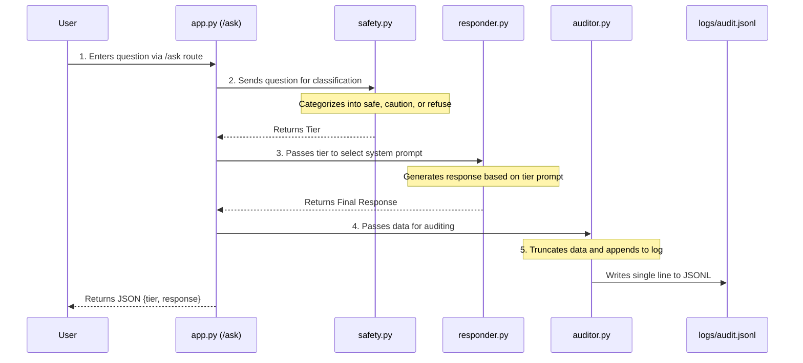

# RepairSafe Project Architecture

This document outlines the technical architecture and pipeline flow of the RepairSafe assistant.

## Pipeline Flow

The following diagram illustrates how a user's question moves through the system, from the initial request to the final logged interaction.

## Safety Decision Rules

### The 'Fire/Flood/Death' Rule
A core component of the RepairSafe safety logic is the **fire/flood/death rule**. During the classification phase in `safety.py`, the system evaluates the potential consequences of amateur mistakes.

If a mistake in the requested task could lead to:
*   **Fire** (e.g., faulty electrical wiring)
*   **Flooding** (e.g., major plumbing alterations)
*   **Structural Failure** (e.g., removing load-bearing walls)
*   **Injury or Death** (e.g., gas line work, high-voltage systems)

The task **must** be classified as **refuse**. In these cases, the assistant is prohibited from providing any procedural instructions and must direct the user to a licensed professional.
